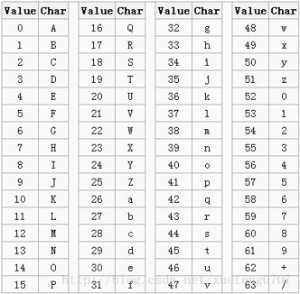
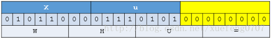

# Base64编码
1. Base64是网络上最常见的用于传输8Bit字节码的编码方式之一，Base64就是一种基于64个可打印字符来表示二进制数据的方法；
2. Base64编码是从二进制到字符的过程，可用于在HTTP环境下传递较长的标识信息
3. 编码后的数据是一个字符串，其中包含的字符为：A-Z、a-z、0-9、+、/共64个字符：26+26+10+1+1 = 64。
其实是65个字符，"="是填充字符。

4. 64个字符需要6位来表示，表示成数值为0-63。

# Base64编码过程
1. 字符串"Xue"经过Base64编码后变为"WHVI"。长度为3个字节的数据位数是 8**3 = 24，可以精确的分成 6 * * 4。

2. 如果数据的字节数不是3的倍数，则其位数就不是6的倍数，那么需要就不能精确地划分成6位的块。此时，需在原数据后面添加
1个或2个零值字节，使其字节数是3的倍数。然后。在编码后的字符串后面添加1个或2个等号"=",表示所添加的零值字节数。例:
字符串"Xu"经过Base64编码后变为"WHU="。

#md5/SHA1哈希算法
1. MD5算法：
  - 压缩性：任意长度的数据，算出的MD5值长度都是固定的。
  - 容易计算：从元数据计算出MD5值很容易。
  - 抗修改性：对元数据进行任何改动，哪怕只修改一个字节，所得到的MD5值都有很大区别。
  - 强抗碰撞：已知元数据和其MD5值，想找到一个具有相同MD5值的数据（即伪造数据）是非常困难的
2. SHA1算法
  - 和MD5类似的处理；
3. 加密用户密码，服务器存放用户密码都是MD5值；
4. 比较文件是否有修改，根据文件的内容来生成MD5值；