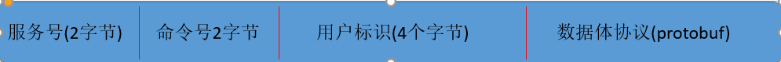
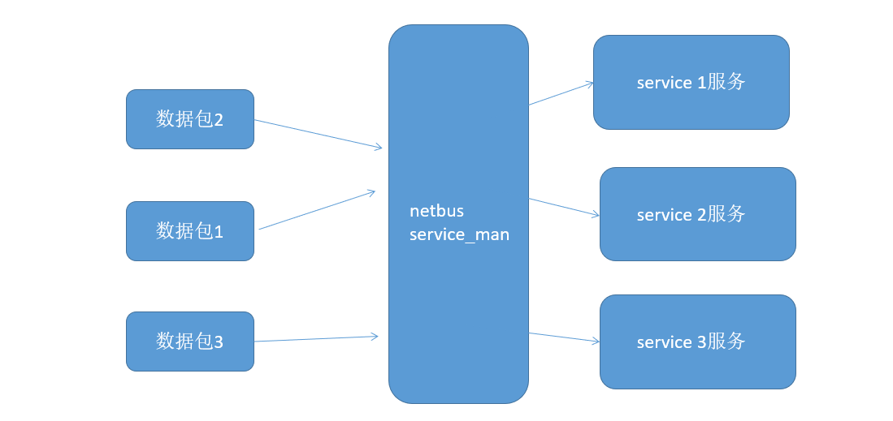

# service与service管理
## 命令格式
1. 如图
 
 

2. - 服务号：属于那个服务;
   - 命令号：属于哪个命令;
   - 用户标识：服务器内部来存放用户的UID信息;
   - 数据体：加密/解密 protobuf协议/json协议来封装数据，根据用户来选择;

## service架构


## service
1. 每一个服务都对应一个服务对象;
2. 当请求发给对应服务的时候，服务根据命令类型来处理业务逻辑;
3. 每一个服务都向服务管理对象注册号，服务号-->service对象;
4. service是一个抽象类，所有的各种的服务都会继承于它;
5. service manager注册一个服务保存好 stype-->service对象的映射;
6. 当解码出命令的时候，根据服务号，转发给对应的模块;
7. 服务器开发人员基于service来开发，你只要开发自己的service并注册给netbus就可以了。
8. service接口
 ```
 class service{
 public:
       virtual bool on_session_recv_cmd(session* s,struct cmd_msg* msg)；//收到命令
	   virtual void on_session_disconnect(session* s)；//连接断开
 }
 ```
9. service_man
```
class service_man{
public:
      static bool register_service(int stype,service* s)；//注册服务
	  static bool on_recv_cmd_msg(session* s.struct cmd_msg* msg)；//收到命令
	  static void on_session_disconnect(session* s)；//断开连接
}
```